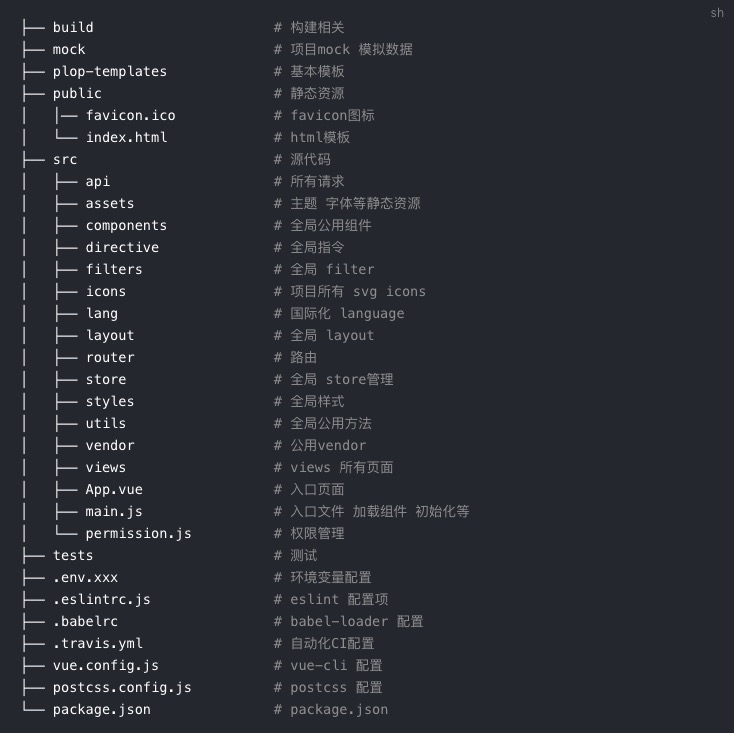
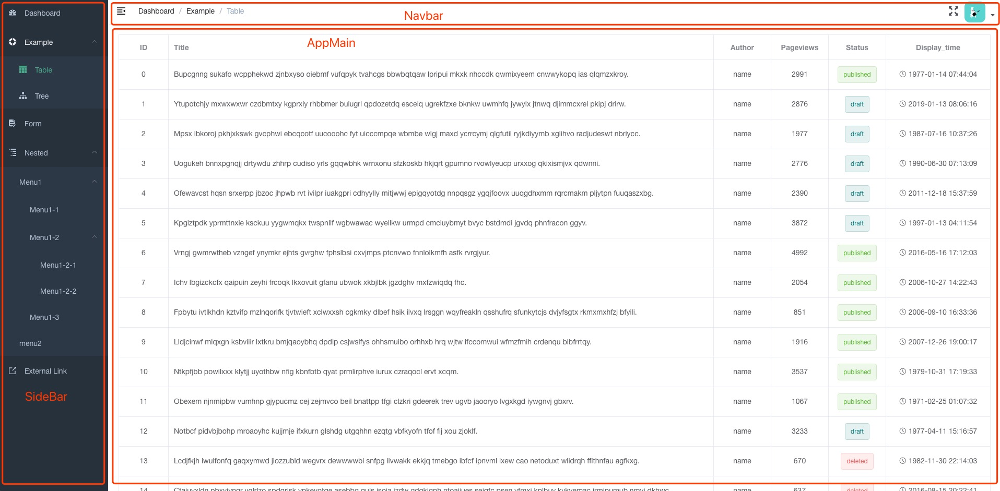
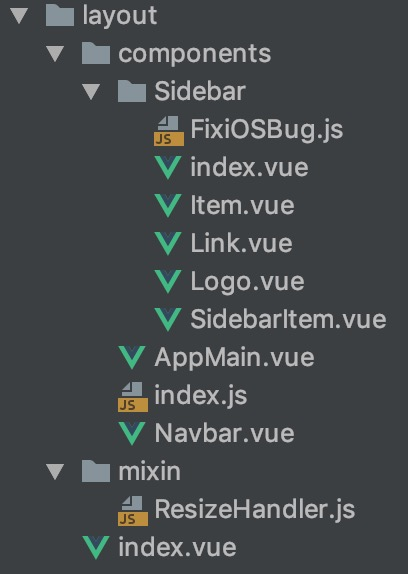
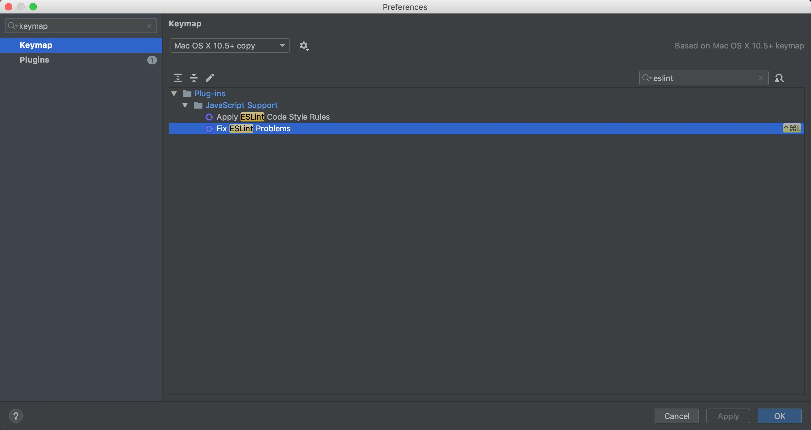

# **zabbix_manager开发规范**
## 写在前面  
该项目是在[vue-element-admin](https://panjiachen.gitee.io/vue-element-admin-site/zh/guide/)项目基础上进行二次开发，尽量按照官方指南的建议来开发, 下面是在官方指南上补充的一些开发规范  

0. 项目解构简单介绍  
     
  页面功能模块写在views里面, 公共模块写在components里面    
1. 项目中的模块按文件夹划分, 每个具体功能模块文件夹必须存在一个index.vue或者是index.js 作为该模块的入口。  
2. 功能模块尽量拆分为各个子组件，各个子组件通过参数交互，在index中组合 ，具体可以参照项目中的layout模块。layout模块将页面分成以下了三个主要部分  
   
   + Sidebar.vue
   + Navbar.vue
   + AppMain.vue
   
   其中Sidebar在代码中有具体拆分成了Link Logo SidebarItem等部分来定义Sidebar的菜单项、显示logo、菜单项中的link等功能具体页面模块  
     
   之前开发时，做类似功能的时候都是在一个vue文件中完成所有功能，就会存在一个问题, 如果某个功能模块需要一个功能，此功能在别的模块中已经存在，但是由于该模块内部没有进行拆分，从而导致功能无法复用，最典型的一个例子就是数据列表功能，经常会跨模块使用。现在希望开发项目时可以先粗略的将功能页面划分为几个相互独立的子模块，开发完成后在index里组合，如果有比较泛用的子模块，也可以重构到系统公共组件中。**不要求**一次就可以模块划分的有多细，但是要先尽量按照这个思路来开发。
3. 与后台交互的请求统一放在src/api下面按模块建立单独js文件 采用es6模块化写法  
   ```
   示例代码 api/table.js:

   import request from '@/utils/request'

   export function getList(params) {
   return request({
       url: '/table/list',
       method: 'get',
       params
   })
   }
   ```
   ```
   示例代码 table/index.vue
   import { getList } from '@/api/table'

   methods: {
   fetchData() {
       this.listLoading = true
       getList().then(response => {
       this.list = response.data.items
       this.listLoading = false
       })
   }
   }
   ```  
   这样写优势在于后台接口可以复用  
4.  项目中需要根据不同环境切换的参数，在项目根目录中.env开头的文件中添加在项目中用‘process.env.[param]’来引用  打包时使用vue-cli-service build --mode staging 来构建不同环境的包 现有.env.production env.development env.staging三个文件 
[详细说明](https://cli.vuejs.org/zh/guide/mode-and-env.html#%E6%A8%A1%E5%BC%8F)  
5. 现在项目中已经集成了font-awesome free图标库，优先使用该图标库来保持风格统一，如果是在找不到在可以将svg格式的图标放入src/icons/svg 文件夹中通过``<svg-icon/>``来使用  将font-awesome官网图标的class设置到``<svg-icon/>``的``icon-class``属性中即可``<svg-icon icon-class="fas fa-address-book" />``  
6. 不要使用idea自带的代码格式化功能, 用Fix EsLint Problems进行代码格式化, 在keymap中设置自己顺手的快捷键(建议使用control + command + l), 确保运行时不要有eslint的报错，如果有特殊情况可以针对具体问题添加忽略ESlint的注释
     
7. ``<style>``和``<script>``标签规范化

   ``<style>``需要指明lang, 项目中主要使用scss则需要写成``<style lang="scss">`` 

   ``<script>``默认情况下不需要加``type ``, 如果需要写vue的render则必须加上 ``<script type="text/jsx">``否则idea不能正确识别代码影响格式化  

8. 自定义组件需要在菜单`自定义组件示例`菜单中，写对应的用法指南
9. vue路由跳转使用系统内部的$open方法，如果需要用到param参数则param参数必须在url中有所体现。
10. 路由按模块引用，不要写在一个文件中，不利于维护
11. 风格指南

    本项目的风格指南主要是参照 `vue` 官方的[风格指南](https://cn.vuejs.org/v2/style-guide/index.html)。在正真开始使用该项目  之前建议先阅读一遍指南，这能帮助让你写出更规范和统一的代码。当然每个团队都会有所区别。其中大部分规则也都配置在了  [eslint-plugin-vue](https://github.com/vuejs/eslint-plugin-vue)之中，当没有遵循规则的时候会报错，详细内容见[eslint]  (./eslint.md)章节。
  
    当然也有一些特殊的规范，是不能被 eslint 校验的。需要人为的自己注意，并且来遵循。最主要的就是文件的命名规则，这里拿  `vue-element-admin`来举例。
  
    ## Component
  
    所有的`Component`文件都是以大写开头 (PascalCase)，这也是官方所[推荐的](https://cn.vuejs.org/v2/style-guide/index.html#%E5%8D%95%E6%96%87%E4%BB%B6%E7%BB%84%E4%BB%B6%E6%96%87%E4%BB%B6%E7%9A%84%E5%A4%A7%E5%B0%8F%E5%86%99-%E5%BC%BA%E7%83%88%E6%8E%A8%E8%8D%90)。。
  
    但除了 `index.vue`。
  
    例子：
  
    - `@/src/components/BackToTop/index.vue`
    - `@/src/components/Charts/Line.vue`
    - `@/src/views/example/components/Button.vue`
  
    ## JS 文件
  
    所有的`.js`文件都遵循横线连接 (kebab-case)。
  
    例子：
  
    - `@/src/utils/open-window.js`
    - `@/src/views/svg-icons/require-icons.js`
    - `@/src/components/MarkdownEditor/default-options.js`
  
    ## Views
  
    在`views`文件下，代表路由的`.vue`文件都使用横线连接 (kebab-case)，代表路由的文件夹也是使用同样的规则。
  
    例子：
  
    - `@/src/views/svg-icons/index.vue`
    - `@/src/views/svg-icons/require-icons.js`
  
    使用横线连接 (kebab-case)来命名`views`主要是出于以下几个考虑。
  
    - 横线连接 (kebab-case) 也是官方推荐的命名规范之一 [文档](https://cn.vuejs.org/v2/style-guide/index.html#%E5%8D%95%E6%96%87%E4%BB%B6%E7%BB%84%E4%BB%B6%E6%96%87%E4%BB%B6%E7%9A%84%E5%A4%A7%E5%B0%8F%E5%86%99-%E5%BC%BA%E7%83%88%E6%8E%A8%E8%8D%90)
    - `views`下的`.vue`文件代表的是一个路由，所以它需要和`component`进行区分(component 都是大写开头)
    - 页面的`url` 也都是横线连接的，比如`https://www.xxx.admin/export-excel`，所以路由对应的`view`应该要保持统一
    - 没有大小写敏感问题

待续....
   
